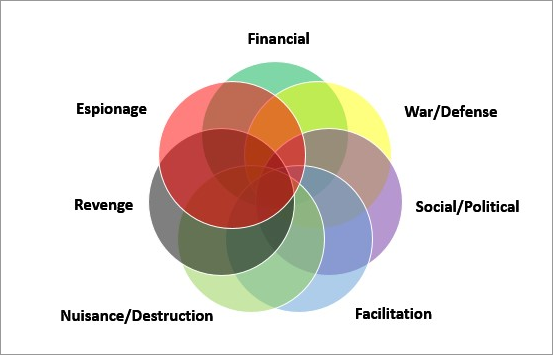

### Module 1: A. Introduction, B. Steps & Categories of Cyber Crime

#### 1. Summarize the various categories of hackers and explain their functionalities.

Hackers can be broadly categorized into different groups based on their intentions and activities:

- **White Hat Hackers (Ethical Hackers):** These hackers work to strengthen cybersecurity. They use their skills to find vulnerabilities in systems and help organizations improve their security.
- **Black Hat Hackers:** These hackers engage in malicious activities, such as unauthorized access, data theft, and spreading malware. Their intentions are usually harmful, and they may exploit vulnerabilities for personal gain.
- **Grey Hat Hackers:** This category includes hackers who operate between white hat and black hat hackers. They may find vulnerabilities without permission but disclose them to the organization afterward.
- **Script Kiddies:** These individuals have limited technical skills and often use pre-written scripts or tools to launch attacks. They usually don't have a deep understanding of the systems they are attacking.
- **Hacktivists:** These hackers have a political or social agenda. They aim to promote their causes through cyber-attacks, often targeting government or corporate entities.
- **State-Sponsored Hackers:** Backed by governments, these hackers conduct cyber-espionage or cyber-warfare. They aim to gather intelligence or disrupt the operations of other nations.

#### 2. i) List the various needs of cybersecurity policies.

**Needs of Cybersecurity Policies:**

- **Protection of Sensitive Data:** Safeguarding confidential information from unauthorized access.
- **Network Security:** Ensuring the integrity and availability of network resources.
- **Incident Response:** Establishing procedures to respond to and recover from security incidents.
- **User Education:** Educating users on security best practices to prevent social engineering attacks.
- **Regulatory Compliance:** Adhering to legal and industry regulations to avoid penalties.

#### 2. ii) Differentiate between software attacks and hardware attacks.

**Software Attacks vs. Hardware Attacks:**

- *Software Attacks:* These focus on exploiting vulnerabilities in software, such as viruses, malware, or ransomware. They aim to compromise the integrity and functionality of programs and systems.
- *Hardware Attacks:* These involve exploiting vulnerabilities in physical components, such as tampering with hardware devices or stealing sensitive information from physical systems. Hardware attacks can also target the supply chain, introducing malicious components during manufacturing.

#### 3. Compare and contrast between cybercrime and cyber terrorism with proper examples.

**Cybercrime:**

- *Definition:* Cybercrime refers to illegal activities conducted through the use of computers and the internet.
- *Example:* Online fraud, identity theft, hacking for financial gain.

**Cyber Terrorism:**

- *Definition:* Cyber terrorism involves using cyber-attacks to create fear or coerce a government or society for political purposes.
- *Example:* Launching a cyber-attack on critical infrastructure like power grids with the aim of causing widespread panic.

#### 4. Categorize the different types of vulnerabilities.

Vulnerabilities can be categorized as follows:

- **Software Vulnerabilities:** Flaws in software code that can be exploited, such as buffer overflow or SQL injection.
- **Hardware Vulnerabilities:** Weaknesses in physical components, including firmware vulnerabilities.
- **Network Vulnerabilities:** Weaknesses in network protocols or configurations that can be exploited for unauthorized access.
- **Human-Related Vulnerabilities:** Social engineering exploits that target human behavior to gain unauthorized access.

#### 5. Analyze the role of CIA triad in dealing with vulnerabilities.

The CIA triad comprises:

- **Confidentiality:** Protecting information from unauthorized access.
- **Integrity:** Ensuring the accuracy and reliability of data.
- **Availability:** Ensuring that information and systems are available when needed.

By addressing each element of the CIA triad, organizations can enhance their overall security posture, mitigating vulnerabilities effectively.

#### 6. Classify Cyber Crimes and Categorize Cyber Criminals?

**Cyber Crimes Classification:**

- **Financial Crimes:** Online fraud, identity theft.
- **Cyber Espionage:** Stealing sensitive information for political or economic gain.
- **Cyber Warfare:** Attacks on a nation's critical infrastructure for political or military purposes.
- **Intellectual Property Theft:** Unauthorized access and theft of intellectual property.
- **Online Harassment:** Cyberbullying, stalking, and harassment online.

**Cyber Criminals Classification:**

- **Hackers:** White hat, black hat, grey hat.
- **Criminal Organizations:** Groups involved in cybercrime for financial gain.
- **State-Sponsored Actors:** Government-backed hackers for political or military purposes.
- **Insiders:** Employees or individuals with insider knowledge exploiting vulnerabilities.

#### 7. Write a short note on: Cryptography & Cybersecurity [5]

**Cryptography & Cybersecurity:**
Cryptography plays a vital role in cybersecurity by providing techniques to secure communication and protect data. It involves encoding information in a way that only authorized parties can access and understand it. Cryptographic protocols and algorithms are used to ensure confidentiality, integrity, and authenticity in digital communications. Common cryptographic techniques include encryption, digital signatures, and hash functions. In cybersecurity, cryptography is a fundamental tool for securing sensitive information and maintaining the privacy and integrity of data.

#### 8. ‘Social Networking is increasingly becoming a source of cybercrime’ – Explain. [5]

Social networking platforms are susceptible to various cybercrimes due to their widespread usage and the sharing of personal information. Cybercriminals exploit social networks for:

- **Phishing Attacks:** Creating fake profiles or sending deceptive messages to trick users into revealing sensitive information.
- **Identity Theft:** Harvesting personal details from social media profiles for fraudulent activities.
- **Cyberbullying:** Harassment, defamation, and threats through social media platforms.
- **Social Engineering:** Manipulating individuals into disclosing confidential information or performing actions that compromise security.

As social networking continues to grow, the risk of cybercrime on these platforms increases, necessitating effective security measures.

#### 9. Discuss Email spoofing and Email spamming. [5]

**Email Spoofing:**
Email spoofing involves forging the sender's address to make an email appear as if it's from a trusted source. Cybercriminals use email spoofing for phishing attacks, spreading malware, or gaining unauthorized access. Spoofed emails often deceive recipients into taking harmful actions, such as clicking on malicious links or providing sensitive information.

**Email Spamming:**
Email spamming is the indiscriminate sending of unsolicited emails, often for advertising or phishing purposes. Spam emails can overwhelm email servers, decrease productivity, and pose security risks. Cybercriminals use spamming to distribute malware, phishing links, or other malicious content.

Both email spoofing and spamming exploit weaknesses in email systems, emphasizing the need for robust email security measures.

#### 10. Differentiate between Black hat Hackers and White hat Hackers. [4]

**Black Hat Hackers:**

- Intent: Malicious and harmful intentions.
- Activities: Unauthorized access, data theft, spreading malware.
- Motivation: Personal gain, causing harm, criminal activities.
- Legality: Engages in illegal activities.

**White Hat Hackers:**

- Intent: Ethical and constructive intentions.
- Activities: Finding and fixing vulnerabilities, improving security.
- Motivation: Enhancing cybersecurity, helping organizations.
- Legality: Engages in legal and authorized activities.

#### 11. Write down the steps of ‘Cyber Attack’ and explain each step. [5]

**Steps of a Cyber Attack:**

1. **Reconnaissance:** Gathering information about the target, including vulnerabilities and potential entry points.
2. **Weaponization:** Developing or obtaining malicious tools or malware for the attack.
3. **Delivery:** Transmitting the malicious payload to the target system or network.
4. **Exploitation:** Taking advantage of vulnerabilities to gain unauthorized access.
5. **Installation:** Installing malware or backdoors for persistent access.
6. **Command and Control (C2):** Establishing communication channels for remote control.
7. **Actions on Objectives:** Executing the main goals of the attack, such as data theft or disruption.
8. **Exfiltration:** Removing stolen data from the compromised system.
9. **Persistence:** Maintaining access and control for future activities.
10. **Covering Tracks:** Erasing evidence to avoid detection.

Explanation: Each step is crucial in the lifecycle of a cyber attack, from initial information gathering to achieving the attacker's objectives and covering their tracks to evade detection.

#### 12. Mention various methods of ID Theft and its consequences leading to monetary loss and social defamation. [5]

**Methods of ID Theft:**

- **Phishing:** Deceptive emails or websites trick individuals into revealing personal information.
- **Social Engineering:** Manipulating individuals to disclose sensitive information through psychological tactics.
- **Data Breaches:** Cybercriminals gain unauthorized access to databases containing personal information.
- **Identity Cloning:** Creating a fake identity using stolen personal details.
- **Skimming:** Capturing credit card information from card readers.

**Consequences:**

- **Monetary Loss:** Stolen funds, unauthorized transactions, and financial exploitation.
- **Social Defamation:** Damage to reputation and credibility due to misuse of personal information for fraudulent activities.

#### 13. Categorize and elaborate the various motives of attackers using a block diagram. [7]

**Motives of Attackers:**

1. **Financial Gain:**

   - *Activities:* Online fraud, stealing financial information, ransomware attacks.
   - *Motivation:* Monetary profit.
2. **Political or Ideological Motivation:**

   - *Activities:* Cyber espionage, hacking for political purposes.
   - *Motivation:* Promoting political agendas or ideologies.
3. **Competitive Advantage:**

   - *Activities:* Corporate espionage, stealing intellectual property.
   - *Motivation:* Gaining a competitive edge in business.
4. **Disruption and Chaos:**

   - *Activities:* Cyber warfare, attacks on critical infrastructure.
   - *Motivation:* Creating chaos and disrupting normal operations.
5. **Hacktivism:**

   - *Activities:* Cyber-attacks to promote social or political causes.
   - *Motivation:* Advocacy for a particular social or political agenda.
6. **Personal Revenge:**

   - *Activities:* Targeted attacks to harm individuals personally.
   - *Motivation:* Settling personal scores or seeking revenge.
7. **Thrill and Challenge:**

   - *Activities:* Hacking for the excitement and challenge.
   - *Motivation:* Enjoyment and proving technical prowess.

Understanding the diverse motives helps in developing comprehensive cybersecurity strategies tailored to specific threat landscapes.
