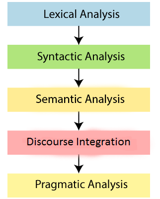

### 1. Discuss in detail the steps of Natural Language Processing. Discuss with examples the various levels of ambiguity in Natural Language. (10 points)

### **Natural Language Processing Steps:**

#### a. Lexical Analysis:

- **Definition:** Lexical analysis involves deciphering and segmenting language into meaningful units, such as paragraphs, sentences, phrases, and words.
- **Process:**
  - Identifying lexemes: The text is broken down into lexemes, which are the basic units of meaning.
  - Categorizing into parts of speech (POS): Words are classified based on their grammatical functions.
  - Identifying morphemes: Lexemes are further divided into morphemes, the smallest units of meaning.
- **Example:** Analyzing the sentence "the understandable vocabulary that makes up a language" involves identifying lexemes like "vocabulary" and "language," categorizing them as nouns, and breaking them into morphemes like "understand-" and "-able."

#### b. Syntactic Analysis:

- **Definition:** Syntactic analysis examines how words and phrases arrange to form grammatically correct sentences.
- **Process:**
  - Checking grammar: Evaluating the arrangement of words for proper syntax.
- **Example:** The sentence "Dave wrote the paper" passes syntactic analysis, while "Dave do jumps" is deemed syntactically incorrect.

#### c. Semantic Analysis:

- **Definition:** Semantic analysis aims to understand the literal meaning of individual language selections, focusing on the meaning of words, phrases, and sentences.
- **Process:**
  - Understanding meaning: Assessing the actual meaning of language selections.
- **Example:** "Manhattan calls out to Dave" might pass syntactic analysis but fails semantic analysis because it doesn't make literal sense for a place to call out to someone.

#### d. Pragmatic Analysis:

- **Definition:** Pragmatic analysis focuses on interpreting the intended meaning rather than the literal meaning of language.
- **Process:**
  - Deriving intended meaning: Assessing the context to understand the speaker's intended meaning.
- **Example:** Understanding that "Manhattan speaks to all its people" is likely a metaphorical expression rather than a literal statement.

#### e. Discourse Integration:

- **Definition:** Discourse integration involves analyzing prior words and sentences to understand the meaning of ambiguous language.
- **Process:**
  - Contextual analysis: Understanding the context by considering preceding words and sentences.
- **Example:** If one sentence mentions "Manhattan speaks to all its people," discourse integration helps understand that "It" in the following sentence refers to Manhattan.

### **Levels of Ambiguity:**

- **Lexical Ambiguity:** Words with multiple meanings. Example: "Bank" (financial institution or river bank).
- **Syntactic Ambiguity:** Ambiguity in sentence structure. Example: "I saw the man with the telescope" (Did I use the telescope or did the man have it?).
- **Semantic Ambiguity:** Ambiguity in the meaning of words or phrases. Example: "She saw the man on the hill with the telescope" (Who has the telescope?).
- **Pragmatic Ambiguity:** Ambiguity in the implied meaning due to context. Example: "Can you pass me the salt?" (Could mean passing the salt physically or verbally).

---

#### NLP Levels: [javatpoint]([https://www.javatpoint.com/nlp]())

**Natural Language Processing (NLP) Phases:**

1. **Lexical Analysis and Morphological:**

   - Scans the source code as a stream of characters.
   - Converts it into meaningful lexemes.
   - Divides the text into paragraphs, sentences, and words.
   - *Example:* In the sentence "Running quickly, she reached the finish line," lexemes include "Running," "quickly," "she," "reached," "the," and "finish line."
2. **Syntactic Analysis (Parsing):**

   - Checks grammar and word arrangements.
   - Establishes relationships among words.
   - *Example:* In "The cat chased the mouse," identifies subject ("cat"), verb ("chased"), and object ("mouse").
3. **Semantic Analysis:**

   - Focuses on meaning representation.
   - Interprets the literal meaning of words and sentences.
   - *Example:* "It's raining cats and dogs" is interpreted as heavy rainfall, not literal animals falling.
4. **Discourse Integration:**

   - Depends on preceding sentences.
   - Invokes the meaning of sentences that follow.
   - *Example:* If Person A says, "I'm going to the store," and Person B responds with "Pick up some milk," discourse integration relates Person B's statement to Person A's plan.
5. **Pragmatic Analysis:**

   - Considers the intended effect.
   - Applies rules for cooperative dialogues.
   - *Example:* "Open the door" is interpreted as a request if spoken politely or as an order if given with authority.

---

### 2. Explain the algorithm to edit one string X of length n to a string Y of length m. Show the steps of your algorithm for X=INTENTION and Y=EXECUTION (10 points)

**Algorithm: Edit Distance (Dynamic Programming)**

1. **Initialization:** Create an (n+1) x (m+1) matrix.
2. **Base Cases:** Fill in the first row and column with values 0 to n and 0 to m respectively.
3. **Dynamic Programming:** Fill in the matrix using recurrence relation:
   - If X[i] equals Y[j], then D[i][j] = D[i-1][j-1].
   - Otherwise, D[i][j] = min(D[i-1][j], D[i][j-1], D[i-1][j-1]) + 1.
4. **Backtracking:** Trace the matrix back to find the operations that lead to the minimum edit distance.

### 3. (i) What is bag of Words? (2 points) (ii) What is TF-IDF? Mention its application (3 points)

**i) Bag of Words (BoW):**

- **Definition:** BoW is a representation of text that ignores the order and structure but considers the frequency of words.
- **Example:** For the sentence "The cat in the hat," the BoW representation would be: {The: 2, cat: 1, in: 1, hat: 1}.

**ii) TF-IDF (Term Frequency-Inverse Document Frequency):**

- **Definition:** TF-IDF is a numerical statistic that reflects the importance of a word in a document relative to a collection of documents (corpus).
- **Formula:** TF-IDF = TF (Term Frequency) * IDF (Inverse Document Frequency).
- **Application:** It is widely used in information retrieval and text mining tasks. For example, in document classification, TF-IDF helps in identifying the importance of words in distinguishing one category from another.

This helps to weigh down the impact of common words and highlight words that are distinct to a particular document.

### 4. (i) Define morphemes (1 point) (ii) Discuss two levels of morphology with suitable examples (4 points)

**i) Morphemes:**

- **Definition:** Morphemes are the smallest units of meaning in a language. They can be words or parts of words that carry semantic significance.
- **Example:** In the word "unhappiness," "un-" and "-ness" are morphemes. "Un-" denotes negation, and "-ness" denotes a state or quality.

**ii) Two Levels of Morphology:**

1. **Free Morphemes:**

   - **Definition:** Can stand alone as complete words.
   - **Example:** In the sentence "She is happy," both "she" and "happy" are free morphemes.
2. **Bound Morphemes:**

   - **Definition:** Cannot stand alone and must attach to a free morpheme.
   - **Example:** In the word "happiness," "-ness" is a bound morpheme attached to the free morpheme "happy."

### 5. Discuss with an example the various levels of ambiguity in Natural Language? (Module 1/CO1/Understand-LOCQ) (5 points)

- Ambiguity in natural language refers to situations where a word, phrase, sentence, or discourse can have multiple interpretations or meanings. Here are examples illustrating various levels of ambiguity:

##### a. **Lexical Ambiguity:**

Lexical ambiguity arises when a word has multiple meanings.

Example: **"Bank"**

- Ambiguity: Does it refer to a financial institution or the edge of a river?
- Sentence: "I went to the bank to deposit my paycheck."

##### b. **Syntactic Ambiguity:**

Syntactic ambiguity occurs due to the structure or arrangement of words in a sentence.

Example: **"I saw the man with the telescope."**

- Ambiguity: Who has the telescope? Did I use it, or did the man have it?
- Interpretation 1: I saw a man who had a telescope.
- Interpretation 2: I used a telescope to see a man.

##### c. **Semantic Ambiguity:**

Semantic ambiguity involves ambiguity in the meaning of words or phrases.

Example: **"She saw the man on the hill with the telescope."**

- Ambiguity: Who has the telescope?
- Interpretation 1: She observed a man who was on the hill, and he had the telescope.
- Interpretation 2: She was on the hill and used the telescope to see a man.

##### d. **Pragmatic Ambiguity:**

Pragmatic ambiguity arises due to implied meanings based on context.

Example: **"Can you pass me the salt?"**

- Ambiguity: Is the request for someone to physically pass the salt or to verbally tell them to pass it?
- Contextual Interpretation: The intended meaning relies on the context, like gestures or the current activity.

### 6. Explain Lemmatization and Stemming with an example (Module 3/CO2/Understand-IOCQ) (5 points)

**Lemmatization:**

- **Definition:** Lemmatization is the process of reducing a word to its base or root form.
- **Example:** For the word "running," the lemma is "run." It considers context and the word's part of speech.

**Stemming:**

- **Definition:** Stemming is the process of removing suffixes to obtain a word's root form.
- **Example:** For the word "running," the stem is "run." It is a more heuristic approach and may not always result in a valid word.

| **Feature**             | **Lemmatization**                                                                                                                   | **Stemming**                                                                                                                                              |
| ----------------------------- | ----------------------------------------------------------------------------------------------------------------------------------------- | --------------------------------------------------------------------------------------------------------------------------------------------------------------- |
| **Definition**          | Lemmatization is the process of reducing words to  their base or root form, considering the context and  meaning of the word.   | Stemming is the process of removing prefixes  or suffixes from a word to obtain its root form,  often resulting in the root having no actual meaning. |
| **Goal**                | To obtain the base or dictionary form of a word,  which is a valid word and carries its actual meaning.                              | To obtain the root or base form of a word,  even if the result is not a valid word or may  not carry the original meaning.                            |
| **Output**              | A meaningful word that exists in the language.                                                                                            | May result in a root that is not a valid word or  has a truncated meaning.                                                                                 |
| **Context Sensitivity** | More contextually aware, considers the meaning  of the word in a sentence.                                                           | Context-insensitive, does not consider the meaning  of the word in context.                                                                                |
| **Use Cases**           | Best suited for applications where the meaning  of words is crucial, such as search engines,  chatbots, and sentiment analysis. | Suitable for tasks where variations of words can  be reduced to a common base, such as information  retrieval and text mining.                        |
| **Examples**            | - Running -> Run ` `- Better -> Good                                                                                                 | - Running -> Run ` `- Better -> Bett                                                                                                                       |

**Note:** Lemmatization and stemming are both techniques used in natural language processing (NLP) to reduce words to their base or root form, but they differ in their approaches and outputs. Lemmatization tends to provide more meaningful results by considering the context and meaning of words, whereas stemming is a faster but less context-aware method that may result in non-words. The choice between them depends on the specific requirements of the NLP task.

### 7. (i) What are the advantages of using higher-order N-grams compared to lower-order N-grams in language modeling? (Module4/CO3/Analyse-IOCQ) (3 points)

### (ii) Calculate the bigram probability of the word "apple" following the word "green" based on the given data. (Module 4/CO3/Apply-IOCQ) (2 points)

**i) Advantages of Higher-Order N-grams:**

- **Greater Contextual Information:** Higher-order N-grams capture more extended contexts, providing a better understanding of the language structure.
- **Improved Accuracy:** By considering more preceding words, higher-order N-grams can better handle language nuances and improve predictive accuracy.
- **Reduced Ambiguity:** Longer contexts help in disambiguating between words with multiple meanings.

**ii) Bigram Probability Calculation:**

- **Given Data:**
  - Count of "green": 50
  - Count of "green" followed by "apple": 10
- **Bigram Probability:**
  - P("apple" | "green") = Count("green apple") / Count("green")
  - P("apple" | "green") = 10 / 50
  - P("apple" | "green") = 0.2

### 8. How do homonyms create ambiguity in language, and why is disambiguation important?

### - (i) Illustrate with suitable examples the different levels in NLP (5 points)

### - (ii) List and explain challenges of natural language processing (5 points)

### - (iii) How do you evaluate the performance of an NLP model? (5 points)

**i)** How Homonyms Create Ambiguity:

1. **Multiple Meanings**: Homonyms are words that have the same spelling or pronunciation but different meanings. This inherent ambiguity can lead to confusion in understanding the intended message.
2. **Context Dependency**: The meaning of a homonym often relies heavily on the context in which it's used. Without context, it's challenging to determine the correct interpretation.
3. **Semantic Overlap**: Homonyms may have related but distinct meanings, causing semantic overlap and making it challenging to discern the intended sense without additional context.

#### Importance of Disambiguation:

1. **Precision in Understanding**: Disambiguation techniques enable precise understanding by clarifying which specific meaning of the homonym is intended in a given context.
2. **Minimize Misinterpretation**: Ambiguity can lead to misinterpretation, especially in machine-driven language processing systems. Disambiguation minimizes these errors.
3. **Improved Communication**: Clear communication is essential. Disambiguation ensures that the message sender's intended meaning is accurately conveyed to the recipient.
4. **Enhanced NLP Performance**: In Natural Language Processing tasks, disambiguation optimizes algorithms by ensuring they can accurately interpret and process language, leading to improved performance.
5. **Better Search Results**: In search engines, disambiguation helps to refine search queries and provide more relevant results by understanding the user's intent.
6. **Reduction of Ambiguity**: By disambiguating homonyms, the level of ambiguity in language processing is reduced, allowing for more precise and reliable outcomes.
7. **Support in Decision Making**: In applications like sentiment analysis or automated decision-making systems, disambiguation helps in making more informed decisions based on accurate interpretations.

#### NLP Levels: [javatpoint]([https://www.javatpoint.com/nlp]())

**Natural Language Processing (NLP) Phases:**

1. **Lexical Analysis and Morphological:**

   - Scans the source code as a stream of characters.
   - Converts it into meaningful lexemes.
   - Divides the text into paragraphs, sentences, and words.
   - *Example:* In the sentence "Running quickly, she reached the finish line," lexemes include "Running," "quickly," "she," "reached," "the," and "finish line."
2. **Syntactic Analysis (Parsing):**

   - Checks grammar and word arrangements.
   - Establishes relationships among words.
   - *Example:* In "The cat chased the mouse," identifies subject ("cat"), verb ("chased"), and object ("mouse").
3. **Semantic Analysis:**

   - Focuses on meaning representation.
   - Interprets the literal meaning of words and sentences.
   - *Example:* "It's raining cats and dogs" is interpreted as heavy rainfall, not literal animals falling.
4. **Discourse Integration:**

   - Depends on preceding sentences.
   - Invokes the meaning of sentences that follow.
   - *Example:* If Person A says, "I'm going to the store," and Person B responds with "Pick up some milk," discourse integration relates Person B's statement to Person A's plan.
5. **Pragmatic Analysis:**

   - Considers the intended effect.
   - Applies rules for cooperative dialogues.
   - *Example:* "Open the door" is interpreted as a request if spoken politely or as an order if given with authority.

### **ii) Challenges in NLP:**

##### Challenges of Natural Language Processing:

1. **Ambiguity:**

   - **Explanation:** Natural language is inherently ambiguous, with words often having multiple meanings and structures leading to varied interpretations. Resolving ambiguity is challenging for NLP systems, especially in understanding context-dependent nuances.
2. **Lack of Context Understanding:**

   - **Explanation:** NLP systems may struggle to grasp the broader context of a conversation, making it difficult to interpret the meaning of ambiguous words or phrases correctly. Understanding context is crucial for accurate language processing.
3. **Idiomatic Expressions and Slang:**

   - **Explanation:** Idioms, colloquialisms, and slang expressions pose challenges as they often deviate from literal meanings. NLP systems may struggle to comprehend these non-literal usages, impacting the accuracy of interpretation.
4. **Data Quality and Quantity:**

   - **Explanation:** NLP algorithms heavily rely on large and diverse datasets for training. Insufficient or biased data can result in skewed models, affecting the system's ability to handle a wide range of language variations and nuances.
5. **Complex Sentence Structures:**

   - **Explanation:** Sentences with intricate structures, such as nested clauses or complex syntactic arrangements, pose challenges for parsing and syntactic analysis. Extracting accurate meaning from convoluted sentences is a persistent challenge.

##### Additional Challenges:

6. **Named Entity Recognition (NER):**

   - **Explanation:** Identifying and classifying entities like names, locations, and organizations accurately is challenging due to variations, abbreviations, and evolving terminology.
7. **Coreference Resolution:**

   - **Explanation:** Resolving references to entities mentioned earlier in the text (coreference) can be challenging, impacting the system's ability to maintain a coherent understanding of the discourse.
8. **Multilingualism:**

   - **Explanation:** Handling multiple languages and understanding cross-language nuances presents challenges. Translation, sentiment analysis, and other tasks become more complex in multilingual contexts.
9. **Dynamic Language Evolution:**

   - **Explanation:** Language is dynamic, evolving over time with new words, expressions, and grammatical shifts. Keeping NLP models updated to cope with language evolution is an ongoing challenge.
10. **Privacy and Ethical Concerns:**

    - **Explanation:** Processing natural language often involves handling sensitive information. Ensuring privacy, security, and ethical use of data pose challenges in NLP applications, particularly in healthcare, finance, and legal domains.

### **iii) Evaluation of NLP Model:**

### Evaluating the Performance of an NLP Model:

1. **Accuracy Metrics:**

   - **Explanation:** Accuracy measures the overall correctness of predictions, indicating the percentage of correctly classified instances. While straightforward, it may not be sufficient for imbalanced datasets or when specific classes are more critical than others.
2. **Precision, Recall, and F1 Score:**

   - **Explanation:** Precision measures the accuracy of positive predictions, recall assesses the model's ability to capture all relevant instances, and the F1 score balances both. These metrics are crucial for tasks like sentiment analysis or named entity recognition.
3. **Confusion Matrix:**

   - **Explanation:** A confusion matrix provides a detailed breakdown of true positive, true negative, false positive, and false negative predictions. It offers insights into the model's strengths and weaknesses, especially in binary or multiclass classification.
4. **Area Under the ROC Curve (AUC-ROC):**

   - **Explanation:** AUC-ROC evaluates the trade-off between true positive rate and false positive rate across various threshold values. It is particularly useful for binary classification tasks and provides a comprehensive view of the model's discrimination ability.
5. **BLEU Score (for Machine Translation):**

   - **Explanation:** BLEU (Bilingual Evaluation Understudy) measures the similarity between machine-generated translations and reference translations. It assesses the quality of translations and is commonly used in machine translation tasks.

### Additional Evaluation Measures:

6. **Perplexity (for Language Models):**

   - **Explanation:** Perplexity evaluates the efficiency of language models by assessing how well they predict a sample text. Lower perplexity values indicate better language model performance.
7. **Mean Squared Error (for Regression Tasks):**

   - **Explanation:** In regression tasks, mean squared error measures the average squared difference between predicted and actual values. It quantifies the model's accuracy in predicting continuous outcomes.
8. **Cross-Validation:**

   - **Explanation:** Splitting the dataset into training and testing sets may lead to variability in model performance. Cross-validation assesses the model's consistency by training and testing on multiple subsets of the data.
9. **Computational Efficiency:**

   - **Explanation:** Beyond predictive accuracy, evaluating how quickly the model processes data is essential. Efficient models with low computational requirements are preferred, especially in real-time or resource-constrained environments.
10. **Domain-Specific Metrics:**

    - **Explanation:** Some NLP tasks have domain-specific metrics. For sentiment analysis, metrics like accuracy, precision, recall, and F1 score may be supplemented with sentiment-specific measures like sentiment agreement.

### Considerations for Evaluation:

- **Data Quality:**

  - Ensure that the evaluation dataset is representative, diverse, and free from biases to provide reliable insights into the model's generalization.
- **Task-Specific Metrics:**

  - Choose evaluation metrics aligned with the specific task and goals of the NLP model, as different tasks may prioritize different aspects of performance.
- **Human Evaluation:**

  - In certain cases, human evaluators may be involved to assess subjective aspects of performance, such as language fluency or coherence.
- **Continuous Monitoring:**

  - NLP models should be continuously monitored and re-evaluated, especially as data distributions change or new challenges arise.

### **9. What are stopwords? Give example (3 points)**

### Stopwords in Natural Language Processing:

1. **Definition:**

   - **Stopwords** are commonly used words in a language that are often removed from text during the preprocessing phase of natural language processing (NLP) to focus on more meaningful words. These words are generally considered as noise in the analysis because they occur frequently but don't contribute significant semantic meaning.
2. **Examples of Stopwords:**

   - In English, examples of stopwords include common words like "the," "and," "is," "of," "in," and "it." These words are fundamental to sentence structure but may not carry substantial information about the content.
3. **Purpose of Removing Stopwords:**

   - **Enhancing Relevance:** By removing stopwords, NLP models can focus on words that contribute more to the meaning of a text, leading to more relevant analyses.
   - **Reducing Dimensionality:** Stopwords, being highly frequent, can dominate the feature space. Removing them helps reduce dimensionality and computational complexity.
   - **Improving Efficiency:** Stopword removal streamlines downstream tasks such as sentiment analysis, text classification, and information retrieval by eliminating noise words.

### Example:

Consider the sentence: "The quick brown fox jumps over the lazy dog."

- **With Stopwords:**

  - "The," "quick," "brown," "fox," "jumps," "over," "the," "lazy," and "dog" are all present.
- **After Removing Stopwords:**

  - "Quick," "brown," "fox," "jumps," "lazy," and "dog" remain.

The removal of stopwords allows focus on the words that convey the primary meaning of the sentence, facilitating more effective language analysis.

### **10. i) What is a regular expression (3 points)**

    **ii) Write regular expressions for the following languages:** 

**
    a) the set of all alphabetic strings;**

**
    b) the set of all lowercase alphabetic strings ending in a b;** 

**
    c) the set of all strings from the alphabet a, b such that each a is immediately preceded by and immediately followed by a b;** 

**
    d) 4·3 Gb (8 points)** 

**
    iii) Differentiate between top-down and bottom-up parsing (3 points)**

### 10. i) What is a regular expression (3 points)

###### Definition:

- **Regular Expression (Regex):**
  - A regular expression, often abbreviated as regex, is a powerful tool used in computer science and linguistics for pattern matching within strings. It is a sequence of characters that defines a search pattern, helping to locate, match, and manipulate text based on specific rules.

###### Key Components of Regular Expressions:

1. **Literal Characters:**

   - Characters in a regex that match themselves. For example, the regex "cat" matches the sequence "cat" in a text.
2. **Metacharacters:**

   - Special characters with a reserved meaning in regex. Examples include:
     - `.` (dot): Matches any single character.
     - `*` (asterisk): Matches zero or more occurrences of the preceding character.
     - `+` (plus): Matches one or more occurrences of the preceding character.
     - `|` (pipe): Acts as a logical OR, allowing multiple alternatives.
3. **Character Classes:**

   - A set of characters enclosed in square brackets `[ ]`. For example, `[aeiou]` matches any vowel.
4. **Anchors:**

   - Specify the position in the string where a match should occur. Examples include `^` (caret) for the beginning of a line and `$` (dollar sign) for the end of a line.

### ii) Write regular expressions for the following languages:

**a) Set of All Alphabetic Strings:**

- **Regular Expression:** `^[a-zA-Z]+$`
- **Explanation:** This regex ensures that the entire string consists of one or more alphabetic characters (both uppercase and lowercase).

**b) Set of All Lowercase Alphabetic Strings Ending in "b":**

- **Regular Expression:** `^[a-z]+b$`
- **Explanation:** This regex matches strings that start with one or more lowercase alphabetic characters and end with the letter "b."

**c) Set of All Strings from the Alphabet {a, b} Such That Each "a" is Immediately Preceded by and Immediately Followed by a "b":**

- **Regular Expression:** `^b*ab*$`
- **Explanation:** This regex matches strings that consist of zero or more "b"s followed by an "a" and zero or more "b"s.

**d) 4·3 Gb:**

- **Regular Expression:** `^[0-9]+(\.[0-9]+)?\s*Gb$`
- **Explanation:** This regex matches strings representing data sizes in gigabytes (e.g., "4.3 Gb") allowing for optional decimal parts.

### iii) Differentiate between Top-Down and Bottom-Up Parsing (3 points)

### Top-Down Parsing:

- **Definition:**

  - Top-down parsing is a parsing technique that starts from the root of the parse tree and moves down towards the leaves. It begins with the overall structure and recursively breaks it down into smaller components.
- **Process:**

  1. **Start with the top-level grammar rule.**
  2. **Attempt to match the input against the rule.**
  3. **If there's a match, apply the rule and move to the next level of the tree.**
  4. **Repeat until the entire parse tree is constructed.**

### Bottom-Up Parsing:

- **Definition:**

  - Bottom-up parsing is a parsing technique that starts with the individual components of the input and gradually builds up to the root of the parse tree. It identifies the most basic elements and combines them to form higher-level structures.
- **Process:**

  1. **Begin with the input symbols.**
  2. **Identify basic components and group them into larger structures.**
  3. **Continue grouping until the entire parse tree is constructed.**
  4. **Involves reducing a sequence of input symbols to a higher-level syntactic construct.**

### Key Difference:

- **Top-Down Parsing:**

  - **Approach:** Starts with the top-level structure and decomposes it.
  - **Strategy:** Recursive descent or predictive parsing.
  - **Construction:** Constructs the parse tree from the top towards the leaves.
- **Bottom-Up Parsing:**

  - **Approach:** Starts with individual components and builds up to the top-level structure.
  - **Strategy:** Shift-reduce or LR parsing.
  - **Construction:** Constructs the parse tree from the bottom (leaves) towards the root.

In summary, top-down parsing begins with the overall structure, while bottom-up parsing starts with the individual elements and assembles them into a hierarchical structure.
