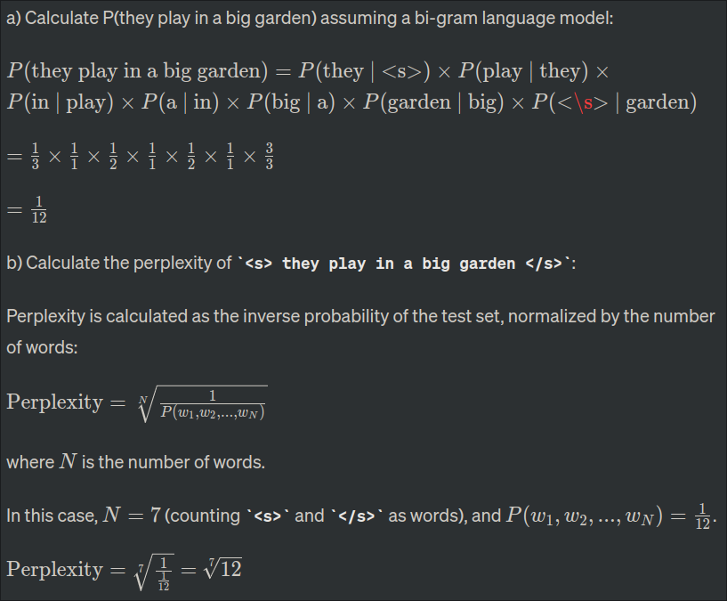

### **11. Homonyms, Ambiguity, and Disambiguation**

**Homonyms and Ambiguity:**

- **Definition:** Homonyms are words with the same spelling or pronunciation but different meanings.
- **Ambiguity Creation:** Different meanings of homonyms can lead to confusion as the intended sense depends on context.

**Importance of Disambiguation:**

- **Context Clarification:** Disambiguation helps in determining the correct meaning of a word based on its context.
- **Enhanced Communication:** Resolving ambiguity improves communication and prevents misunderstandings.

### **12. Corpus, Bigram Probability, and Perplexity**

**i) What is a corpus? (2 points):**

A corpus, in linguistics and natural language processing, refers to a large and structured collection of text or spoken language that is used for analysis, research, and study. It serves as a representative sample of a language or a particular domain, and it can be composed of various types of texts, such as books, articles, conversations, or any other form of written or spoken language. Corpora are essential for linguistic studies, language model training, and the development and evaluation of natural language processing algorithms.

**ii) Calculation in a Bi-gram Language Model:**

Given the sentences in corpus C3:

1. "there is a big garden"
2. "children play in a garden"
3. "they play inside beautiful garden"

a) Calculate P(they play in a big garden) assuming a bi-gram language model:



**iii) Advantages of Higher-Order N-grams:**

Advantages of using higher-order N-grams (e.g., trigrams, 4-grams) compared to lower-order N-grams (e.g., bigrams) in language modeling include:

- **Capturing more context:** Higher-order N-grams consider a longer sequence of words, capturing more contextual information and dependencies between distant words.
- **Improved accuracy:** With more context, models can make more informed predictions, leading to improved accuracy in language modeling tasks.
- **Handling complex language structures:** Languages often exhibit complex structures and dependencies that can be better captured by higher-order N-grams.
- **Reducing ambiguity:** Longer context helps in disambiguating between different meanings of words, especially in cases where shorter contexts might lead to ambiguity.

### **13. Part-of-Speech Tagging, Word Classes, Word Sense Disambiguation, TBL Rules**

**13. Part-of-Speech Tagging and Related Concepts**

**i) Part-of-Speech Tagging (4 points):**

- **Definition:** Part-of-Speech tagging, or POS tagging, is the process of assigning grammatical categories (such as noun, verb, adjective, etc.) to each word in a sentence. It is a crucial task in natural language processing (NLP) that enhances understanding and analysis of text.
- **Purpose:**

  - POS tagging aids in syntactic and semantic analysis by indicating the role and function of each word within a sentence.
- **Example:**

  - In the sentence "The cat is sleeping," POS tagging would identify "The" as a determiner (DT), "cat" as a noun (NN), "is" as a verb (VB), and "sleeping" as a verb (VBG).

ii) **Comparison of Open Class & Closed Class Word Groups (4 points):**

- **Open Class Words:**

  - Open class words are lexically rich and accept new additions. They include nouns, verbs, adjectives, and adverbs.
  - Example: "Technology" (noun), "Innovate" (verb), "Brilliant" (adjective), "Quickly" (adverb).
- **Closed Class Words:**

  - Closed class words have a stable set and rarely accept new additions. They include pronouns, prepositions, conjunctions, and determiners.
  - Example: "He" (pronoun), "Under" (preposition), "And" (conjunction), "The" (determiner).

iii) **Word Sense Disambiguation (WSD) (3 points):**

- **Definition:**

  - Word Sense Disambiguation (WSD) is the process of determining the intended meaning (sense) of a word when it has multiple meanings in a given context.
- **Purpose:**

  - WSD is crucial for improving the accuracy of NLP applications, as many words have different meanings based on context.
- **Example:**

  - In the sentence "I saw a bat," WSD distinguishes between "bat" as a flying mammal and "bat" as a sports equipment.

iv) **Transformation-Based Learning (TBL) Rules in NLP (4 points):**

- **Explanation:**

  - Transformation-Based Learning (TBL) is a machine learning approach used in NLP for tasks like error correction and rule-based transformations.
- **Application:**

  - TBL involves creating a set of rules that iteratively transform incorrect or less desirable outputs into correct or more desirable ones.
- **Example:**

  - In spell checking, a TBL rule might be applied to change "teh" to "the" based on the common error of transposing letters.

---

### **14. Ambiguity in Sentences**

**(i) "Time flies like an arrow":**

- **Ambiguity Type:** Syntactic Ambiguity
- **Explanation:** Ambiguity arises from multiple interpretations of the phrase "Time flies" (either as time passing quickly or time as insects).

**(ii) "He crushed the key to my heart":**

- **Ambiguity Type:** Semantic Ambiguity
- **Explanation:** The word "crushed" can be interpreted in different ways, creating ambiguity in the sentence.

### **15. Morphology: Two-level Morphology, Inflectional vs. Derivational Morphology, Porter's Algorithm**

**i. Two-level Morphology:**

- **Definition:** Two-level morphology is a linguistic model that represents the mapping between the surface forms of words and their underlying lexical representations using two levels of rules.
- **Example:** In the word "cats," the surface form includes the plural "s," and the underlying form represents the root "cat." The transformation from "cat" to "cats" is captured by two-level rules.

ii. **Inflectional vs. Derivational Morphology:**

**Inflectional Morphology (2 points):**

- **Definition:**

  - Inflectional morphology involves the modification of a word to express grammatical relationships such as tense, number, gender, case, or mood.
- **Example:**

  - In English, the verb "to walk" undergoes inflection to indicate tense:
    - Present: I walk.
    - Past: I walked.
    - Future: I will walk.

**Derivational Morphology (2 points):**

- **Definition:**

  - Derivational morphology is the process of forming new words by adding prefixes, suffixes, or infixes to a base or root word. It often results in a change in the word's lexical category or meaning.
- **Example:**

  - From the base word "happy," the addition of the suffix "-ness" results in the derived word "happiness," changing from an adjective to a noun.

**Inflectional vs. Derivational Morphology:**

| Aspect                     | Inflectional Morphology                                                                                 | Derivational Morphology                                                   |
| -------------------------- | ------------------------------------------------------------------------------------------------------- | ------------------------------------------------------------------------- |
| **Definition**       | Involves modification for<br />grammatical relationships                                                | Forms new words by adding affixes,<br /> changing meaning or category     |
| **Example**          | Present tense: "I walk"`<br>` <br />Past tense: "I walked" `<br>` <br />Future tense: "I will walk" | Base word "happy" + suffix "-ness" =<br />Derived word "happiness" (noun) |
| **Function**         | Grammatical nuances (tense,<br /> number, gender, case)                                                 | Creation of new words with<br />altered meanings or categories            |
| **Language Example** | English verbs inflect for tense:<br /> "walk," "walked," "will walk"                                    | Derivation from "happy" to "happiness"                                    |

**iii. Porter's Algorithm:**

A. CHARACTARIZATION -> CHARACTAR
B. MULTIDIMENTIONAL -> MULTIDIMENTION

- In Transformation-Based Learning (TBL), rules are applied iteratively to transform or modify words based on a set of transformation rules. The process involves identifying patterns and applying specific transformations to improve the accuracy or performance of natural language processing tasks.

**Transformation-Based Learning (TBL) Rules Application:**

1. **CHARACTARIZATION -> CHARACTAR:**

   - **Rule Applied:** Delete the suffix "-IZATION" to transform the word.
   - **Explanation:** The rule identifies a common suffix ("-IZATION") and removes it to generate a modified form of the word.
2. **MULTIDIMENTIONAL -> MULTIDIMENTION:**

   - **Rule Applied:** Delete the suffix "-AL" to transform the word.
   - **Explanation:** The rule recognizes the suffix ("-AL") as a pattern and eliminates it, resulting in a modified form of the original word.

---

### **16. Tree Structure, Synonymy, Perplexity in Language Modeling**

**i. Tree Structure for ATIS Sentences:**

- *Note:* Tree structures are typically visual, but a textual representation follows the given grammar rules.

  ```
  (1) I prefer a morning flight
  [S [NP I] [VP [V prefer] [NP [Det a] [Nominal [N morning] [N flight]]]]]

  (2) I want a morning flight
  [S [NP I] [VP [V want] [NP [Det a] [Nominal [N morning] [N flight]]]]]
  ```

**(ii) Why is synonymy important in language and communication? (Module 7/CO2/Analyse-IOCQ) (5 points)**

**Importance of Synonymy in Language and Communication:**

1. **Avoidance of Repetition:**

   - Synonyms allow speakers and writers to avoid repetitive use of the same words. This enhances the quality of communication by introducing variety and preventing monotony.
2. **Precision and Nuance:**

   - Synonyms provide options for selecting words with subtle differences in meaning. This precision helps convey nuanced distinctions, making language more expressive and accurate.
3. **Flexibility in Expression:**

   - Synonymy offers flexibility, allowing individuals to choose words based on the context, audience, or desired impact. This adaptability contributes to effective communication in diverse situations.
4. **Enhanced Vocabulary:**

   - Knowledge of synonyms expands vocabulary, enabling individuals to articulate their thoughts more comprehensively. It empowers speakers and writers to choose words that best capture their intended message.
5. **Cultural Sensitivity:**

   - Different cultures may prefer specific synonyms or have unique linguistic nuances. Understanding synonymy contributes to cultural sensitivity, fostering better cross-cultural communication.

**(iii) What is perplexity in the context of language modeling, and why is it an important metric? (Module 4/CO2/Analyse-IOCQ) (5 points)**

**Perplexity in Language Modeling:**

1. **Quantifying Uncertainty:**

   - Perplexity measures the uncertainty or unpredictability of a language model when predicting the next word in a sequence. It provides a numerical assessment of how well the model captures the underlying language patterns.
2. **Inverse Probability Measure:**

   - Calculated as the inverse probability of the test set normalized by the number of words, perplexity gives a relative measure of the model's performance. Lower perplexity indicates better predictive accuracy.
3. **Model Comparison:**

   - Perplexity serves as a valuable metric for comparing different language models. Researchers use it to evaluate and select models that exhibit superior performance in predicting unseen data.
4. **Generalization Ability:**

   - A lower perplexity suggests that the language model generalizes well to diverse linguistic contexts. It reflects the model's ability to understand and adapt to a wide range of language patterns.
5. **Practical Significance:**

   - Improving perplexity implies enhancing the language model's ability to capture syntactic and semantic structures, making it more effective for applications such as machine translation, text generation, and speech recognition.

---

### **17. Hidden Markov Model (HMM) and Viterbi Algorithm**

**(i) Brief Description of Hidden Markov Model (HMM):**

- A Hidden Markov Model (HMM) is a statistical model widely used in various fields, including natural language processing, speech recognition, bioinformatics, and finance. It is a type of probabilistic graphical model that represents a system with hidden states, observable emissions, and transitions between states. HMMs are particularly useful for modeling sequential data and capturing dependencies between successive observations.

### Key Components of an HMM:

1. **States (Hidden and Observable):**

   - **Hidden States (X):** These represent the underlying, unobservable system states. HMM assumes that these states cannot be directly observed.
   - **Observable States (Y):** These are the states that emit observable symbols or observations. In the context of language modeling, observable states might represent words in a sentence.
2. **Transitions:**

   - HMM models the transitions between hidden states. The probability of transitioning from one hidden state to another is governed by transition probabilities.
3. **Emissions:**

   - Each hidden state emits observable symbols with associated probabilities. These emission probabilities define the likelihood of observing a particular symbol when the system is in a specific hidden state.
4. **Initial State Probabilities:**

   - The probability distribution of starting in a particular hidden state.

### HMM Usage in Natural Language Processing (NLP):

- **Part-of-Speech Tagging:** HMMs can be used to model the sequence of part-of-speech tags in a sentence.
- **Speech Recognition:** HMMs are employed to model phonemes and acoustic features in speech signals.
- **Named Entity Recognition:** HMMs can be used to model sequences of words and their corresponding named entity labels.
- **Machine Translation:** HMMs can model the alignment between words in source and target languages.

### Example:

Consider a simple HMM for part-of-speech tagging. The hidden states (X) might represent different parts of speech (e.g., noun, verb), and the observable states (Y) are the actual words in a sentence. The transitions between hidden states and emission probabilities for each observable state are learned from training data.

**(ii) Working of the Viterbi Algorithm in HMM Context:**

- **Objective:**

  - The Viterbi algorithm is employed to find the most likely sequence of hidden states (state path) that explains the observed sequence of emissions.
- **Steps:**

  1. **Initialization:**
     - Initialize a matrix to store the probabilities of the most likely path ending in each state after observing each emission.
  2. **Recursion:**
     - Iterate over each observation, updating the probabilities based on the transitions and emission probabilities. Maintain a traceback to remember the most likely path.
  3. **Termination:**
     - After processing all observations, identify the state with the highest probability in the last column as the endpoint.
  4. **Backtrack:**
     - Backtrack through the traceback to reconstruct the most likely state sequence.
- **Significance:**

  - The Viterbi algorithm efficiently computes the most probable sequence of hidden states, crucial for tasks such as part-of-speech tagging and decoding in speech recognition.
- **Example:**

  - In speech recognition, given observed acoustic features (emissions), the Viterbi algorithm helps determine the sequence of phonemes (hidden states) that best explains the observed speech.

---

### 18. Query Term Proximity and Query Optimization in NLP

**(i) Query Term Proximity:**

- **Definition:** Query term proximity refers to the closeness of terms in a search query, indicating how near or far words are from each other. It is crucial in information retrieval systems, including search engines.
- **Impact on Search Engine Results:**

  - **Relevance:** Higher proximity enhances the relevance of search results. When terms appear close to each other, it suggests a stronger semantic relationship, leading to more accurate matches.
  - **Precision:** Proximity improves result precision by considering the spatial arrangement of terms. Relevant documents are more likely to have the query terms in close proximity.
  - **Semantic Context:** Proximity helps capture the semantic context of phrases and multi-word expressions, providing a better understanding of user intent.
  - **Example:** In the query "natural language processing," higher proximity in search results ensures documents where these words are close, enhancing the likelihood of finding relevant content.

**(ii) Query Optimization in NLP:**

- **Impact on Efficiency:**

  - **Processing Time:** Query optimization reduces processing time by ensuring that the system efficiently retrieves relevant information. Optimized queries lead to faster responses in natural language processing (NLP) applications.
  - **Resource Utilization:** Well-optimized queries improve resource utilization by minimizing unnecessary computations. This is particularly important in resource-intensive tasks like machine translation or sentiment analysis.
  - **Precision and Recall:** Optimization balances precision and recall, ensuring that the system retrieves accurate results without sacrificing overall performance. It helps strike a suitable trade-off based on the application's requirements.
  - **Example:** In a sentiment analysis application, query optimization may involve refining the search for sentiment-related terms, balancing the need for precision in identifying sentiments while efficiently processing large datasets.
- **Overall Efficiency:** Query optimization contributes to the overall efficiency of NLP applications by fine-tuning the search process, reducing redundancy, and enhancing the system's ability to extract meaningful information from textual data.

---

### **19. Application of HMM in Parts-of-Speech Tagging**

- Hidden Markov Models (HMMs) are extensively used in Natural Language Processing (NLP), particularly in the task of Parts-of-Speech (POS) tagging. Here's how HMMs are applied in POS tagging:

### Application of HMM in POS Tagging:

1. **Model Representation:**

   - **States:** HMMs represent words in a sequence as a series of states.
   - **Observations:** Each word corresponds to an observation emitted from these states.
   - **Transition Probabilities:** HMMs employ transition probabilities between states representing the likelihood of moving from one POS tag to another.
   - **Emission Probabilities:** The emission probabilities signify the probability of a specific word being associated with a particular POS tag.
2. **POS Tagging:**

   - **Training Phase:** Initially, the HMM model is trained using a labeled dataset where words are tagged with their corresponding POS tags.
   - **Transition and Emission Probabilities:** Based on this training data, the model learns transition probabilities between POS tags and emission probabilities for each word given a particular tag.
3. **Decoding and Tagging:**

   - **Decoding Algorithm (Viterbi):** During the decoding phase, the Viterbi algorithm is often used with HMMs to determine the most likely sequence of POS tags for a given input sentence.
   - **Tag Assignment:** By calculating probabilities of different tag sequences and choosing the sequence with the highest probability, HMMs assign POS tags to each word in the input sequence.
4. **Example:**

   - Given a sentence "He runs quickly," the HMM-based POS tagger would use transition probabilities to identify that "He" is likely a pronoun, "runs" is a verb, and "quickly" is an adverb.

### Advantages of HMMs in POS Tagging:

- **Statistical Modeling:** HMMs can capture statistical dependencies between words and their POS tags based on the training data.
- **Contextual Information:** They consider the context of neighboring words while assigning POS tags, enhancing accuracy.
- **Efficiency:** HMMs enable relatively efficient tagging by utilizing probabilistic models.
- **Robustness:** They handle unseen words by generalizing based on similar observed contexts during training.
- **Widely Adopted:** HMM-based POS tagging is a well-established technique in NLP and has been used successfully in various applications.

By leveraging the structure of HMMs and their ability to model sequences of observations, POS tagging benefits from the inherent capabilities of these models to assign probable POS tags to words within a given context.

---

### **20. Viterbi Algorithm in the Context of HMMs**

- The Viterbi algorithm is a dynamic programming algorithm used to find the most likely sequence of hidden states in a Hidden Markov Model (HMM) given a sequence of observations. In the context of HMMs, the Viterbi algorithm plays a crucial role in decoding and determining the most probable sequence of states that generated a particular sequence of observations.

### Working of the Viterbi Algorithm in HMMs:

1. **Initialization:**

   - The algorithm begins by initializing a table, often referred to as the Viterbi table, to store intermediate results.
   - Each cell in the table corresponds to a particular state at a specific time step.
2. **Initialization Step (t = 1):**

   - For the first time step (t = 1), the algorithm calculates the probability of transitioning from an initial state to each possible state and multiplying it by the probability of emitting the first observation from that state.
   - The maximum probability for each state is stored in the corresponding cell of the Viterbi table.
3. **Recursion Step (t > 1):**

   - For subsequent time steps (t > 1), the algorithm iterates through each state and computes the maximum probability of reaching that state at the current time step.
   - It considers the probabilities of transitioning from the previous states to the current state, multiplied by the probability of emitting the current observation from the current state.
   - The maximum probability for each state is calculated and stored in the Viterbi table.
4. **Termination:**

   - Once the algorithm processes all time steps, the final step involves selecting the state with the highest probability in the last time step. This state represents the most likely ending state of the sequence.
5. **Backtracking:**

   - After determining the most probable path through the states, the algorithm backtracks through the Viterbi table to reconstruct the sequence of states that led to the maximum probability.

### Example:

Consider an HMM for POS tagging where states represent POS tags, observations are words, and transitions/emissions have associated probabilities. The Viterbi algorithm would find the most likely sequence of POS tags for a given sentence.

### Advantages of the Viterbi Algorithm in HMMs:

- **Efficiency:** The Viterbi algorithm efficiently computes the most likely state sequence without exploring all possible combinations.
- **Dynamic Programming:** It exploits the principle of optimal substructure, breaking down the problem into smaller subproblems.
- **Probabilistic Inference:** By considering transition and emission probabilities, the algorithm provides a probabilistic interpretation of the most likely state sequence.
- **Widely Applicable:** The Viterbi algorithm is used not only in POS tagging but also in various applications involving sequential data and HMMs.

In summary, the Viterbi algorithm is a fundamental tool in decoding HMMs, providing a systematic and efficient way to identify the most likely hidden state sequence given observed data.
