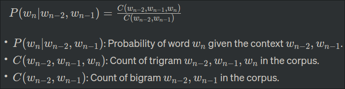
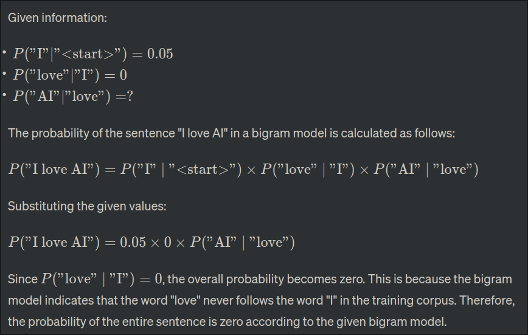

**31. Steps Before Applying NLP Machine-Learning Algorithm on a Corpus**

Before applying an NLP machine-learning algorithm to a corpus, several preprocessing steps are typically performed:

1. **Eliminating White Spaces:** Remove unnecessary spaces to ensure uniformity and readability.
2. **Eliminating Punctuation:** Strip punctuation marks to focus on the textual content.
3. **Lowercase to Uppercase Conversion:** Convert all text to lowercase to treat words with different cases as the same.
4. **Tokenization:** Break down the text into individual words or tokens for analysis.
5. **Getting Rid of Stopwords:** Remove common words (stopwords) that don't contribute much to the overall meaning.
6. **Lemmatization:** Reduce words to their base or root form for better analysis.

These steps help clean and prepare the corpus for effective machine-learning algorithms, improving accuracy and efficiency.

**32. Computing Minimum Edit Distances for "drive" and "brief" or "divers"**

Using 1-insertion, 1-deletion, and 2-substitution costs:

- `drive` → `b_ive` (1 substitution)
- `b_ive` → `brief` (1 insertion)

Minimum Edit Distance for "drive" to "brief": 2

For "drive" to "divers":

- `drive` → `div_` (1 substitution)
- `div_` → `divers` (1 insertion)

Minimum Edit Distance for "drive" to "divers": 2

Both "brief" and "divers" have the same minimum edit distance of 2 from "drive."

**33. Design an FSA for English Numbers 1-99**

\[ FSA \]
States: q0 (initial), q1 (final)
Alphabet: {1, 2, ..., 9, 10, ..., 90, 91, ..., 99}

Transitions:

- From q0 to q1 on input 1, 2, ..., 9 (transition for units)
- From q1 to q1 on input 10, 20, ..., 90 (transition for tens)
- From q1 to q1 on input 1, 2, ..., 9 (transition for units after tens)

Acceptance: q1 (final state) is an accepting state.

This FSA accepts English numbers from 1 to 99.

**34. FSA for Time-of-Day Expressions**

\[ FSA \]
States: q0 (initial), q1, q2, q3, q4, q5, q6 (final)
Alphabet: {one, two, ..., twelve, quarter, half, o'clock, midnight, noon}

Transitions:

- From q0 to q1 on input {one, two, ..., twelve} (transition for hours)
- From q1 to q2 on input {o'clock} (transition for o'clock)
- From q2 to q3 on input {midnight, noon} (transition for special cases)
- From q1 to q4 on input {quarter, half} (transition for quarter/half past)
- From q4 to q5 on input {to} (transition for quarter/half to)
- From q5 to q6 on input {one, two, ..., twelve} (transition for hours after "to")

Acceptance: q6 (final state) is an accepting state.

This FSA accepts time-of-day expressions like "eleven o'clock," "twelve-thirty," "midnight," or "a quarter to ten."

**35. Types and Tokens**

- **Definition:**

  - **Token:** A token is an instance of a sequence of characters in a particular utterance or written text. It is an individual occurrence of a linguistic unit.
  - **Type:** A type is a class of items that share common characteristics. In linguistics, it refers to a unique, distinct form or element.
- **Example:**

  - Sentence: "They picnicked by the pool, then lay back on the grass and looked at the stars."
  - **Tokens:** They, picnicked, by, the, pool, then, lay, back, on, the, grass, and, looked, at, the, stars (16 tokens)
  - **Types:** They, picnicked, by, the, pool, then, lay, back, on, grass, and, looked, at, stars (14 types)

**36. Porter Stemming Algorithm and Information Retrieval**

The Porter stemming algorithm aims to reduce words to their base or root form, which can improve information retrieval in search engines. However, its impact depends on the context and the specific goals of the information retrieval system.

**Justification:**

- **Advantages:**

  - **Normalization:** Stemming reduces words to their root, normalizing different forms of a word.
  - **Increased Recall:** It helps in capturing variations of a word, increasing recall in information retrieval.
- **Challenges:**

  - **Overstemming and Understemming:** Porter stemming may overstem (reduce unrelated words to the same stem) or understem (leave related words unstemmed).
  - **Semantic Loss:** Stemming may lead to the loss of semantic meaning, impacting precision.

The decision to use Porter stemming depends on the trade-off between recall and precision in a particular information retrieval context.

**37. Equation for Trigram Probability Estimation**

- 

**38. N-gram Models in Text Prediction and Challenges**

- **Application:**

  - **Text Prediction:** N-gram models predict the next word in a sequence given the previous context. They are widely used in language modeling and text completion.
- **Challenges:**

  - **Data Sparsity:** As the order of the N-gram increases, the data needed for accurate estimation grows, leading to sparse data issues.
  - **Long-Term Dependencies:** N-grams struggle to capture long-term dependencies in language, affecting prediction accuracy.
  - **Size of N:** Choosing the appropriate order (size) of the N-gram involves a trade-off between precision and computational efficiency.

Addressing these challenges requires sophisticated techniques, such as smoothing methods and neural language models, to enhance the performance of N-gram models in text prediction tasks.

**39. Advantages of Higher-Order N-grams in Language Modeling**

- **Richer Context:**

  - Higher-order N-grams consider a more extensive context of preceding words, providing a richer linguistic context for modeling.
- **Improved Precision:**

  - By incorporating additional words into the context, higher-order N-grams can capture more intricate relationships and nuances in language, leading to improved precision.
- **Handling Ambiguity:**

  - Language often exhibits ambiguity that can be resolved with a broader context. Higher-order N-grams are better equipped to disambiguate between different interpretations.
- **Long-Term Dependencies:**

  - For tasks requiring an understanding of long-term dependencies between words, higher-order N-grams are more effective in maintaining context over a more extended sequence.
- **Reduced Data Sparsity Issues:**

  - With a larger context, higher-order N-grams mitigate data sparsity problems common in lower-order models, where the frequency of specific sequences may be limited.

**40. Bigram Language Model Calculation**

