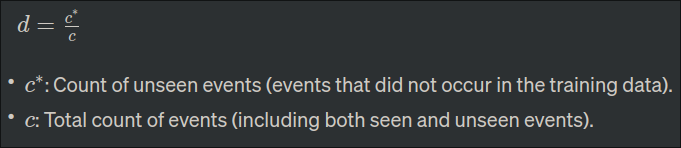

### **41. Smoothing in Language Modeling**

#### **(i) What is Smoothing? Why is it required? (4 points)**

- **Smoothing:**

  - Smoothing is a technique used in language modeling to handle the issue of zero probabilities for unseen n-grams. It involves redistributing probability mass from seen n-grams to unseen ones, preventing the model from assigning zero probability to unseen events.
- **Why Smoothing is Required:**

  - In natural language, it's common to encounter unseen n-grams (word sequences) in testing data that were not present in the training corpus. Without smoothing, a model might assign zero probability to such unseen n-grams, leading to an inability to generalize and poor performance on new data.

---

#### **(ii) Equation for Add-One Smoothing Discount (5 points)**

- **Add-One Smoothing:**

  - Add-One Smoothing, also known as Laplace Smoothing, is a simple smoothing technique where each count is incremented by one, and the vocabulary size is added to the denominator to account for unseen events.
- **Discount Equation (d = c*/c):**

  - The discount factor (d) for add-one smoothing is calculated as the ratio of the adjusted count (c*) to the original count (c).

  

---

#### **(iii) Witten-Bell Smoothing (4 points)**

- **Witten-Bell Smoothing:**

  - Witten-Bell Smoothing is a more sophisticated smoothing method that addresses the shortcomings of simple add-one smoothing. It estimates probabilities based on the observed and unobserved events in the training data.
- **Differences:**

  - Witten-Bell Smoothing adapts to the data by considering the number of unique n-grams observed and unobserved, providing a more nuanced approach compared to the uniform increment used in add-one smoothing. It is designed to handle unseen events more effectively.

---

### **42. What is Perplexity in Language Modeling? (5 points)**

- **Perplexity:**

  - Perplexity is a measure of how well a probability distribution or language model predicts a given dataset. In the context of language modeling, perplexity quantifies how well the model predicts a sequence of words.
- **Importance of Perplexity:**

  - Lower perplexity indicates better model performance. It serves as a useful metric for evaluating the effectiveness of language models, allowing comparison between different models or variations of the same model.

---

### **43. Why POS Tagging is Required in NLP? (5 points)**

- **POS Tagging in NLP:**

  - POS (Part-of-Speech) tagging is essential in NLP for assigning grammatical categories (tags) to words in a sentence. It involves labeling each word as a specific part of speech (e.g., noun, verb, adjective), aiding in syntactic and semantic analysis.
- **Importance of POS Tagging:**

  - Enables better understanding of sentence structure.
  - Facilitates semantic analysis by identifying the syntactic role of each word.
  - Supports information extraction, sentiment analysis, and other NLP tasks.

---

### **44. Tagging Errors in Penn Treebank Tagset (6 points)**

1. **Tagging Error in Sentence 1:**

   - Incorrect: `Atlanta/NN Atlanta/NNP`
   - Correction: `Atlanta/NNP Atlanta/NNP` (Assuming both instances refer to the same location.)
2. **Tagging Error in Sentence 2:**

   - Incorrect: `dinner/NNS dinner/NN`
   - Correction: `dinner/NN dinner/NN` (Assuming both instances refer to the same concept.)
3. **Tagging Error in Sentence 3:**

   - Incorrect: `Denver/NNP have/VBP`
   - Correction: `Denver/NNP have/VB` (Correcting the POS tag for "have" based on context.)
4. **Tagging Error in Sentence 4:**

   - Incorrect: `flights/NNS Can/MD`
   - Correction: `flights/NNS Can/VBP` (Assuming "Can" is a modal verb in this context.)

---

### **45. Part-of-Speech Tagging in Damon Runyon’s Short Stories**

1. **Sentence 1:**

   - It/PRP is/VBZ a/DT nice/JJ night/NN ./.
   - Tags: `It/PRP is/VBZ a/DT nice/JJ night/NN ./.`
2. **Sentence 2:**

   - This/DT crap/NN game/NN is/VBZ over/IN a/DT garage/NN in/IN Fifty-second/NNP Street/NNP.../
   - Tags: `This/DT crap/NN game/NN is/VBZ over/IN a/DT garage/NN in/IN Fifty-second/NNP Street/NNP.../`
3. **Sentence 3:**

   - Nobody/NN ever/RB takes/VBZ the/DT newspapers/NNS she/PRP sells/VBZ.../
   - Tags: `Nobody/NN ever/RB takes/VBZ the/DT newspapers/NNS she/PRP sells/VBZ.../`
4. **Sentence 4:**

   - He/PRP is/VBZ a/DT tall/JJ ,/, skinny/JJ guy/NN with/IN a/DT long/JJ ,/, sad/JJ ,/, mean-looking/JJ kisser/NN ,/, and/CC a/DT mournful/JJ voice/NN ./.
   - Tags: `He/PRP is/VBZ a/DT tall/JJ ,/, skinny/JJ guy/NN with/IN a/DT long/JJ ,/, sad/JJ ,/, mean-looking/JJ kisser/NN ,/, and/CC a/DT mournful/JJ voice/NN ./.`

---

### **46. Importance of Synonymy in Language and Communication (4 points)**

- **Synonymy:**

  - Synonymy refers to the relationship between words that have similar or identical meanings. It plays a crucial role in language and communication for the following reasons:

  1. **Variety of Expression:**

     - Allows speakers and writers to choose from a range of words to convey the same or similar ideas, adding variety and richness to language.
  2. **Precision and Nuance:**

     - Provides the option to select synonyms with subtle differences in meaning, allowing for precise expression and conveying nuanced distinctions.
  3. **Avoiding Repetition:**

     - Enables speakers and writers to avoid repetitive use of the same word, enhancing the overall flow and readability of language.
  4. **Catering to Style and Register:**

     - Accommodates different styles of writing and registers by offering alternatives that may be more formal, informal, technical, or colloquial.

---

### **47. Homonymy vs. Polysemy in Linguistics (5 points)**

- **Homonymy:**

  - Homonymy refers to the linguistic phenomenon where two or more words share the same form (spelling or pronunciation) but have different meanings. The differences in meaning may be unrelated.
- **Polysemy:**

  - Polysemy, on the other hand, involves the situation where a single word has multiple related meanings. These meanings are often connected through a common semantic thread.
- **Differences:**

  - Homonyms are unrelated in meaning, while polysemous meanings share a common semantic origin.

---

### **48. Polysemy with Example (3 points)**

- **Example: The Word "Bank"**

  - The term "bank" is polysemous with multiple related meanings:
    1. **Financial Institution:**
       - "I have an account at the bank."
    2. **River Bank:**
       - "We sat by the bank of the river."
- **Explanation:**

  - In this example, the word "bank" has distinct yet related meanings, showcasing polysemy.

---

### **49. Prior Probability and Likelihood Probability using Bayesian Method (5 points)**

- **Prior Probability:**

  - The prior probability represents the initial belief or probability assigned to an event before considering new evidence. Denoted as \( P(A) \), it reflects the probability of event \( A \) without additional information.
- **Likelihood Probability:**

  - The likelihood probability represents the probability of observing evidence given a specific hypothesis. Denoted as \( P(E|A) \), it assesses how well the evidence aligns with the hypothesis.
- **Bayesian Method:**

  - Bayes' theorem combines prior probability and likelihood probability to update the probability of a hypothesis after considering new evidence:

  \[ P(A|E) = \frac{P(E|A) \cdot P(A)}{P(E)} \]

---

### **50. Confusion Matrix in NLP (2+ points)**

- **Confusion Matrix:**

  - A confusion matrix is a table used to evaluate the performance of a classification algorithm. It presents a summary of the true positive (TP), true negative (TN), false positive (FP), and false negative (FN) predictions.
- **Importance in NLP:**

  - In NLP, a confusion matrix is valuable for assessing the accuracy and effectiveness of models,

 especially in tasks like sentiment analysis, named entity recognition, and part-of-speech tagging. It provides insights into model strengths and weaknesses by quantifying the types of classification errors.
